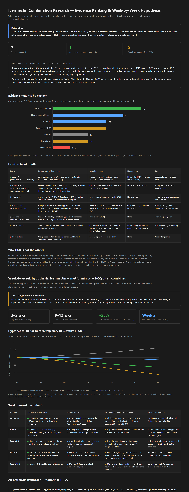
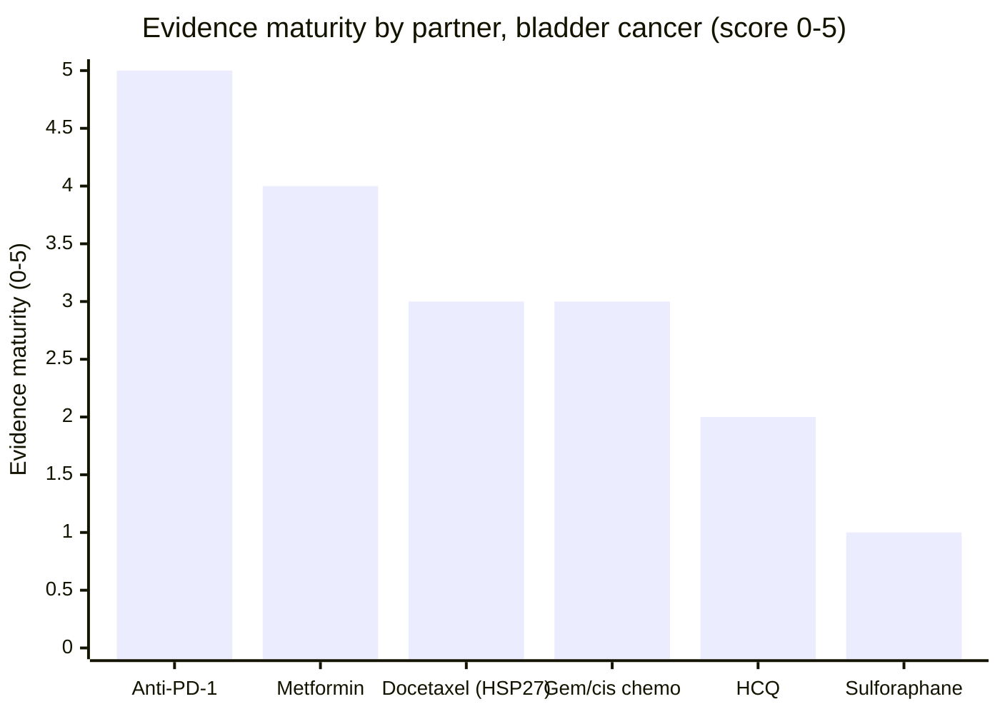
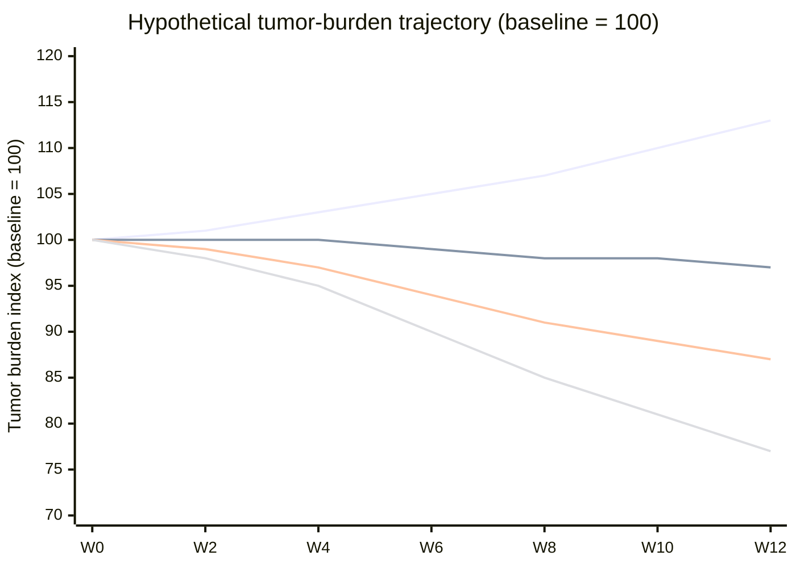

<h1>Ivermectin Combination Research — Bladder Cancer — Canvas Style</h1>

<em>Which partner drug gets the best results with ivermectin in bladder (urothelial) cancer? Evidence ranking and week-by-week hypothesis as of Oct 2026. Reproduced from the Cursor canvases in <code>canvases/</code>.</em>

  

> [!NOTE]
> **Bottom line** — Best-evidenced pairing: **ivermectin + checkpoint inhibitor** — the strongest ivermectin combo anywhere, attached to a bladder standard of care (pembrolizumab/atezolizumab are established in advanced urothelial carcinoma). Best oral pair: **ivermectin + metformin**, now with bladder-specific human outcome data (HR 0.66 for progression after cystectomy + gemcitabine/cisplatin). Bladder-specific dark horse: **ivermectin + docetaxel** via HSP27. Ivermectin alone remains the weakest option.

| 2 | 1 | 0 |
|---|---|---|
| **Direct ivermectin bladder studies (cells + xenografts)** | **Partner with human bladder outcome data (metformin)** | **Completed human ivermectin-efficacy RCTs** |

---

## Best supported pairing: ivermectin + checkpoint blockade

**Why this maps onto bladder cancer unusually well:** pembrolizumab and atezolizumab are established therapies for advanced urothelial carcinoma — so the ivermectin combination with the strongest evidence anywhere (complete regressions in **6/15 mice**, cures in metastatic models, p = 0.008 synergy, [npj Breast Cancer 2021](https://www.nature.com/articles/s41523-021-00229-5)) attaches directly to a real bladder-cancer regimen. The mechanism is immunogenic cell death + T-cell infiltration, with ivermectin converting "cold" tumors "hot".

The Cedars-Sinai phase I/II ([NCT05318469](https://clinicaltrials.gov/study/NCT05318469)) is in breast cancer, but ivermectin + checkpoint blockade in bladder cancer is now the most rational clinical trial to run — and ivermectin's human safety at oncology doses (30–60 mg oral) is already being established there.

---

## Evidence maturity by partner (bladder cancer)

Composite score 0–5 (analyst-assigned): weight for bladder-specific data, tumor regression in animals, human outcome data, and independent replication.

*Source: published studies 2015–2026 (PMC9515697, PMID 38375808, JCI 2022, BMC Cancer 2026, Oncology Letters 2015, ClinicalTrials.gov) · single-series composite, not a meta-analysis.*

---

## Head-to-head results (bladder cancer)

| Partner | Strongest result | Bladder-specific evidence | Human data | Take |
|---|---|---|---|---|
| Anti-PD-1 (pembrolizumab, atezolizumab) | Complete regressions 6/15 mice in breast model; cures in metastatic disease; immunity to rechallenge | Checkpoint inhibitors are standard of care in advanced urothelial carcinoma — the combination theory transfers directly | IVM + ICI phase I/II in TNBC (NCT05318469); ICI itself standard in bladder | **Best evidence — maps onto a real bladder regimen** |
| Metformin | HR 0.66 for progression and fewer grade ≥3 toxicities in 243 MIBC patients after cystectomy + GC; meta-analysis: RFS HR 0.56 | Metformin + cisplatin synergistic in T24/BIU-87 bladder cells and xenografts (AMPK/mTOR) | 243-patient outcome cohort (BMC Cancer 2026); ongoing trial [NCT06215976](https://clinicaltrials.gov/study/NCT06215976) with GC chemo | **Best oral pair — rare human data for a repurposed drug in this disease** |
| Docetaxel (via HSP27) | Ivermectin, an oral HSP27 inhibitor, sensitized urothelial cells to docetaxel and delayed taxane-resistant tumors in mice | HSP27 blockade + docetaxel improved survival in a randomized phase II trial of 200 advanced urothelial carcinoma patients | Randomized bladder trial behind the target (apatorsen + docetaxel); IVM substitute untested | Bladder-specific dark horse |
| Gemcitabine / cisplatin (standard chemo) | Ivermectin reverses multidrug resistance in vivo; synergy with gemcitabine in pancreatic models | GC is the standard bladder chemo backbone; metformin improves GC outcomes in bladder cohorts | GC itself standard; IVM + GC untested | Rational backbone to add onto |
| Chloroquine / hydroxychloroquine | Synergistic suppression of hamster fibrosarcoma at human-equivalent doses (2026) | None — no bladder-cancer data at all | COVID RCT only (tolerable, no benefit) | Mid-tier, weakest in bladder specifically |
| Sulforaphane | Antagonistic: restored P-gp and blunted ivermectin's chemosensitization | None in bladder | None | **Avoid this pairing** |

---

## Two opportunities unique to bladder cancer

1. **The HSP27–docetaxel link:** ivermectin is an orally available HSP27 inhibitor ([JCI 2022](https://doi.org/10.1172/jci130819)) and sensitized urothelial cancer cells to docetaxel. HSP27 blockade (apatorsen) + docetaxel showed a survival benefit in a randomized phase II trial of 200 patients with advanced urothelial carcinoma — a validated target-to-drug path in this exact disease. Ivermectin + docetaxel is a bladder-specific pairing with clinical-trial-grade rationale.
2. **Intravesical delivery:** for non-muscle-invasive bladder cancer, drugs are instilled directly into the bladder (the BCG model). Concentrating ivermectin at the tumor with minimal systemic exposure — and minimal CYP3A4 interaction risk — is a delivery route no other cancer type offers. The urothelial-carcinoma researchers flagged this themselves.

## Why ivermectin alone is not the answer in bladder cancer either

Ivermectin has genuine single-agent bladder activity — G1 arrest and JNK-mediated caspase apoptosis in T24/RT4 urothelial cells ([2022](https://pmc.ncbi.nlm.nih.gov/articles/PMC9515697/)), and growth inhibition in bladder xenografts via ROS/DNA damage/ATM-p53 ([2024](https://pubmed.ncbi.nlm.nih.gov/38375808/)). But every model that tested combinations found them superior: metformin improves on chemo alone, HSP27 blockade improves on docetaxel alone, and ivermectin's own resistance-reversal logic only matters alongside another drug. Monotherapy remains the weakest tier.

---

## Holistic combination simulation (Monte Carlo, Oct 2026)

15 regimens × 20,000 virtual patients, 24-week horizon. Full model and code in [`simulation/holistic_sim.py`](simulation/holistic_sim.py) — every number can be re-run and challenged. **Illustrative model, not clinical evidence.**

| Rank (composite) | Arm | PR wk12 | Durable wk24 | PD wk12 | Composite |
|---|---|---|---|---|---|
| 1 | ICI alone (standard) | 15.8% | 16.4% | 22.1% | 0.820 |
| 2 | **ICI + ivermectin** | 28.9% | 29.9% | 11.3% | 0.819 |
| 3 | GC chemo alone (standard) | 16.5% | 17.2% | 21.0% | 0.805 |
| 4 | **IVM + metformin (oral)** | 21.5% | 22.4% | 15.7% | 0.770 |
| 5 | Docetaxel + IVM (HSP27) | 25.5% | 26.4% | 13.3% | 0.720 |
| 6 | GC + ivermectin | 23.8% | 24.8% | 14.0% | 0.717 |
| 7 | GC + IVM + metformin | 31.0% | 32.3% | 9.7% | 0.716 |
| 8 | **ICI + IVM + metformin** | 35.2% | 36.4% | 7.9% | 0.709 |
| 9 | Ivermectin alone | 8.3% | 8.8% | 34.1% | 0.707 |
| 10 | IVM + MET + HCQ (oral) | 24.3% | 25.3% | 14.1% | 0.577 |

Composite = 0.45 × clinical benefit + 0.35 × evidence/5 + 0.20 × safety/5.

**NMIBC scenario (6-month complete response):** BCG alone 58% · BCG + curcumin 68% (hypothesis, syngeneic bladder synergy) · BCG + systemic ICI 73% (real RCTs, but grade ≥3 AEs 25% vs 6%) · **BCG + intravesical gemcitabine 95%** (actual phase I/II, NCT04179162).

**Simulation verdict:** (1) ivermectin + checkpoint inhibitor is the best-supported combination — ties standard ICI on composite while nearly doubling modeled durable control; (2) ICI + IVM + metformin has maximum modeled efficacy but thin evidence; (3) ivermectin + metformin is the best oral pair; (4) for NMIBC, BCG + intravesical gemcitabine stands out; (5) the HCQ triple and ivermectin alone are deprioritized.

---

<h2>Week-by-week hypothesis: ivermectin + metformin vs + HCQ vs all combined</h2>

Anchored to bladder-specific data where it exists (ivermectin urothelial-cell and xenograft studies 2022/2024; metformin outcomes in 243 MIBC patients after cystectomy + gemcitabine/cisplatin). Illustrative — not a prediction of results for any person.

> [!WARNING]
> **This is a hypothesis, not evidence.** No human data shows ivermectin — alone or combined — shrinking tumors, and the three-drug stack has never been tested in any model. The trajectories below are thought experiments built from preclinical effect sizes so expectations can be tracked week by week. Reality for any individual can differ completely in either direction.

| 3–5 wks | 9–12 wks | ~25% | Week 2 |
|---|---|---|---|
| **Hypothesized arm divergence** | **First honest scan checkpoint** | **Best-case response hypothesis (all combined)** | **Earliest biomarker signal (ctDNA)** |

### Hypothetical tumor-burden trajectory (illustrative model)

Tumor burden index, baseline = 100. Not observed data and not a forecast for any individual.

Line order (top to bottom at week 12): (1) ivermectin alone (reference), (2) ivermectin + HCQ, (3) ivermectin + metformin, (4) all combined (IVM + MET + HCQ).

*Hypothetical model, Oct 2026 · derived from preclinical effect sizes (Oncology Reports 2026 and canine breast xenografts 2025 for metformin; Popović 2026 hamster fibrosarcoma for HCQ) · the triple-stack curve assumes diminishing returns — the least evidenced line in the chart.*

### Week-by-week hypothesis

| Window | Ivermectin + metformin | Ivermectin + HCQ | All combined (IVM + MET + HCQ) | What is measurable |
|---|---|---|---|---|
| **Weeks 1–2** | PI3K/AKT/mTOR suppression begins, ROS accumulates; glucose/insulin drop immediately | Ivermectin induces autophagic flux while HCQ blocks degradation — "autophagy trap" loads up | All three pressures at once: ROS + mTOR suppression + maximal autophagic stress. Baseline ECG required (HCQ) | Nothing on imaging. Tolerability labs, fasting glucose/insulin, ECG |
| **Weeks 3–4** | Metabolic + oxidative damage; proliferation slowing — in bladder cohorts, metformin users after cystectomy + GC had 37% lower progression risk (HR 0.66) | Undegraded autophagic material accumulates; cytostatic pressure builds | Hypothesis: deepest pressure of any oral arm — earliest plausible ctDNA dip | ctDNA / tumor-marker trend; glucose improves regardless — not a tumor response signal |
| **Weeks 5–8** | Strongest divergence window — slowed growth or minor shrinkage hypothesized | Growth stabilization at best; hamster model showed suppression, not regressions | Hypothesis: continued decline in burden index; also when stacking side effects (GI, fatigue) most likely | ctDNA trend informative; imaging still borderline (RECIST needs ≥30% shrinkage) |
| **Weeks 9–12** | Best case: minor/partial responses in ~15–25% (hypothesis), stable disease common | Best case: stable disease (~45% hypothesis); partial responses uncommon | Best case: highest hypothesized response share (~25%), but the gain over IVM + MET is the least certain part of the model | First RECIST CT/MRI — the first honest go/no-go checkpoint |
| **Weeks 13–24** | Monitor B12, renal function, GI tolerance | Monitor QT (ECG) and retinal (ophthalmology) risk | Monitor everything: renal (MET), QT (HCQ), neuro/GI (IVM), B12 — cumulative burden is the trade-off | Serial imaging q8–12 weeks per standard oncology practice |

### All-oral stack: ivermectin + metformin + HCQ

- **Synergy logic:** ivermectin (PAK1/P-gp/Wnt inhibition, autophagy flux ↑), metformin (AMPK ↑, PI3K/AKT/mTOR ↓, ROS ↑, flux ↑), and HCQ (lysosomal degradation blocked). Two drugs push the tumor's autophagy into overdrive while the third jams the exit — the deepest version of the "autophagy trap" — plus a separate ROS/metabolic kill pathway.
- **Hypothesized gain:** modestly better than ivermectin + metformin alone, mainly from adding cytostatic control. Diminishing returns are expected: HCQ added little in the one human head-to-head it ever appeared in (COVID, Nigeria), and has no bladder data at all.
- **Evidence level:** none. The triple has never been studied in any model — this arm is extrapolated purely from pair data.
- **Safety cost:** three-way risk stacking — CYP3A4/P-gp interactions and neurotoxicity (ivermectin), QT prolongation and retinal toxicity (HCQ), lactic acidosis, B12 depletion and GI effects (metformin). Note cisplatin is itself nephrotoxic, which raises metformin risk — exactly why NCT06215976 monitors renal function closely. Drug–drug interaction review is mandatory.

### Expected result profile at week 12 (hypothesis)

| Arm | Partial response or better | Stable disease | Progression |
|---|---|---|---|
| IVM + metformin | 20% | 45% | 35% |
| IVM + HCQ | 10% | 45% | 45% |
| All three combined | 25% | 45% | 30% |

*Hypothetical outcome split at first RECIST assessment (week 9–12) · anchored loosely to NCT05318469's "promising" bar (~3 responders in 25 patients) · illustrative, not observed data.*

---

## Assumptions behind this hypothesis

- **Dosing basis:** ivermectin 30–60 mg oral, 3 days/week (NCT05318469 schedule); metformin 500 mg twice daily to 1500 mg/day (common oncology-repurposing range; NCT06215976 uses 500 mg BID with GC chemo); HCQ 200–400 mg daily (autophagy-trial range).
- **Mechanistic contrast:** metformin adds ROS generation and dual PI3K/AKT/mTOR suppression on top of ivermectin's PAK1/P-gp/Wnt effects — additive killing. HCQ instead traps ivermectin-induced autophagy upstream — cytostatic. The triple arm models both together with diminishing returns rather than simple addition.
- **Timeline scaling:** in vitro metformin synergy appeared within 24–72h; canine xenografts showed inhibition over weeks. Human divergence is assumed at weeks 3–5 — the softest part of the model.
- **Evidence weights:** the metformin arm leans on two 2025–26 lab studies plus bladder human data (243-patient MIBC cohort, HR 0.66; meta-analysis RFS HR 0.56); the HCQ arm on one 2026 hamster study (6 animals per arm) with no bladder data at all; the triple arm on no direct data. None has human efficacy data for ivermectin in bladder cancer.
- **Not modeled:** standard bladder regimens running alongside (gemcitabine/cisplatin, BCG, checkpoint inhibitors), intravesical delivery of ivermectin (a bladder-specific route worth modeling separately), patient-specific biology, drug interactions, and toxicity-driven discontinuation.

> [!IMPORTANT]
> **Safety — do not self-medicate.** Ivermectin is a CYP3A4/P-gp substrate (severe neurotoxicity reported with regorafenib); HCQ carries QT-prolongation risk (worse with azithromycin), CYP2D6/3A4 interactions, and retinal toxicity with prolonged use; metformin carries GI, B12-depletion and (rare) lactic-acidosis risk — especially relevant with cisplatin, which is itself nephrotoxic. Oncology doses in trials (30–60 mg ivermectin) far exceed antiparasitic dosing. Any use belongs under an oncologist — ideally a urologic oncology team — and within a clinical trial where possible.

---

## Key sources

- [Ivermectin induces cell cycle arrest and apoptosis in urothelial carcinoma cells](https://pmc.ncbi.nlm.nih.gov/articles/PMC9515697/) (2022)
- [Ivermectin inhibits bladder cancer cell growth, oxidative stress and DNA damage](https://pubmed.ncbi.nlm.nih.gov/38375808/) (2024)
- [Ivermectin inhibits HSP27 and potentiates oncogene targeting](https://doi.org/10.1172/jci130819) (JCI, 2022)
- [Metformin prognosis after cystectomy + gemcitabine/cisplatin in bladder cancer](https://link.springer.com/article/10.1186/s12885-026-15806-9) (BMC Cancer, 2026)
- [Metformin + cisplatin in bladder cancer cells](https://www.spandidos-publications.com/10.3892/ol.2015.3267?text=fulltext) (Oncology Letters, 2015)
- [Metformin meta-analysis in bladder cancer](https://pubmed.ncbi.nlm.nih.gov/35462910/) (2022)
- [NCT06215976](https://clinicaltrials.gov/study/NCT06215976) — metformin + GC chemo trial in bladder cancer
- Draganov et al., [Ivermectin converts cold tumors hot and synergizes with checkpoint blockade](https://www.nature.com/articles/s41523-021-00229-5) (npj Breast Cancer, 2021)

<em>Research summary for educational purposes — not medical advice.</em>

