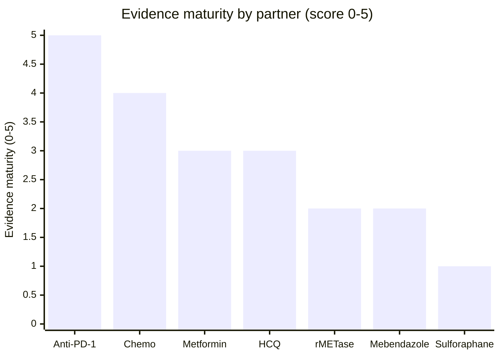
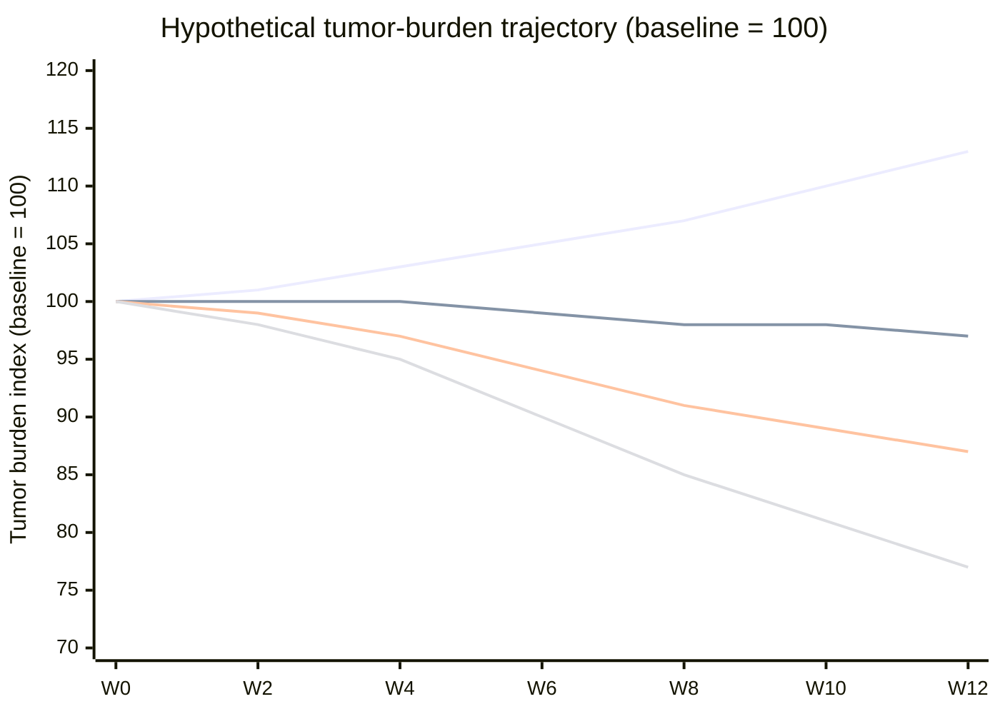

<h1>Ivermectin Combination Research — Canvas Style</h1>

<em>Which partner drug gets the best results with ivermectin? Evidence ranking and week-by-week hypothesis as of Oct 2026. Reproduced from the Cursor canvases in <code>canvases/</code>.</em>

> [!NOTE]
> **Bottom line** — The best-evidenced partner is **immune checkpoint inhibitors (anti-PD-1)**, the only pairing with complete regressions in animals and an active human trial. **Ivermectin + metformin** is the best oral/practical pairing. **Ivermectin + HCQ** is mechanistically sound but mid-tier. **Ivermectin + sulforaphane** should be avoided.

| 7 | 1 | 0 |
|---|---|---|
| **Partners compared** | **Combinations in human cancer trials** | **Completed human efficacy RCTs** |

---

## Best supported pairing: ivermectin + checkpoint blockade

**Strongest result in the entire dataset:** in the 4T1 breast cancer model, ivermectin + anti-PD-1 produced complete tumor regression in **6/15 mice** (vs 1/20 for ivermectin alone, 1/10 for anti-PD-1 alone, 0/25 untreated), with statistical synergy (p = 0.008), cures in the metastatic setting (p < 0.001), and protective immunity against tumor rechallenge. Ivermectin converts immunologically "cold" tumors "hot" (immunogenic cell death, T-cell infiltration, Treg suppression).

This is the only ivermectin combination now in human cancer trials: a Cedars-Sinai phase I/II of ivermectin (30–60 mg oral) + balstilimab/pembrolizumab in metastatic triple-negative breast cancer ([NCT05318469](https://clinicaltrials.gov/study/NCT05318469)), with the broader ICONIC trial ([NCT07487805](https://clinicaltrials.gov/ct2/show/NCT07487805)) planned. No efficacy results reported yet.

---

## Evidence maturity by partner

Composite score 0–5 (analyst-assigned): weight for tumor regression in animals, quality of models, human data, and independent replication.

*Source: published studies 2019–2026 (npj Breast Cancer, J Exp Clin Cancer Res, Pharmaceuticals, Frontiers Oncol, Oncology Reports, ClinicalTrials.gov) · single-series composite, not a meta-analysis.*

---

## Head-to-head results

| Partner | Strongest published result | Model / evidence | Human data | Take |
|---|---|---|---|---|
| Anti-PD-1 (pembrolizumab, balstilimab) | Complete regressions 6/15 mice; cures in metastatic model; immunity to rechallenge | Mouse 4T1 breast (npj Breast Cancer 2021); replicated mechanism | Phase I/II mTNBC recruiting (NCT05318469) | **Best evidence — in trials now** |
| Chemotherapy (doxorubicin, vincristine, gemcitabine, paclitaxel) | Reversed multidrug resistance in vivo; tumor regression in xenografts; 63% tumor reduction with docetaxel/cyclophosphamide/tamoxifen | Cells + mouse xenografts (2019–2024); many independent labs | None as a tested combo | Strong, rational add-on to standard chemo |
| Metformin | Synergy via PI3K/AKT/mTOR inhibition + ROS/autophagy; significant tumor inhibition in breast xenografts | Cells + canine/human xenografts (2025–26) | None as a combo | Promising, cheap, both drugs well-tolerated |
| Chloroquine / hydroxychloroquine | Synergistic, dose-dependent suppression of hamster fibrosarcoma at human-equivalent doses; blocked by deoxycholic acid (NF-κB) | Hamster tumors + human cell lines (2026, single lab); HCQ+IVM nanoparticles in CRC | COVID RCT only (tolerable, no benefit) | Mechanistically sound "autophagy trap" — mid-tier |
| Recombinant methioninase (rMETase) | Beat 5-FU, cisplatin, gemcitabine, paclitaxel combos in colon cells (CI 6.7); only doxorubicin slightly better | In vitro only (2026) | None | Interesting, very early |
| Mebendazole | Observational cohort: 84% "clinical benefit", ~48% self-reported regression/NED | Observational, self-reported (Zenodo preprint); mebendazole alone failed phase 2a in GI cancer | Phase 2a single-agent: no benefit, rapid progression | Weakest real signal — heavy bias likely |
| Sulforaphane | Antagonistic: restored P-gp expression and blunted ivermectin's chemosensitization | Cells (J Exp Clin Cancer Res 2019) | None | **Avoid this pairing** |

---

## Why HCQ is not the winner

Ivermectin + hydroxychloroquine has a genuinely coherent mechanism — ivermectin induces autophagic flux while HCQ blocks autophagosome degradation, trapping cancer cells in a cytostatic state — and one 2026 hamster study showed synergy without toxicity. But it has never been tested in humans for cancer, the key study comes from a single small lab (6 hamsters per arm), and in the one human head-to-head (COVID, Nigeria) adding HCQ to ivermectin gave zero extra benefit and caused withdrawals for reactions. It is a reasonable second-tier research candidate, not a proven therapy.

---

<h2>Week-by-week hypothesis: ivermectin + metformin vs + HCQ vs all combined</h2>

> [!WARNING]
> **This is a hypothesis, not evidence.** No human data shows ivermectin — alone or combined — shrinking tumors, and the three-drug stack has never been tested in any model. The trajectories below are thought experiments built from preclinical effect sizes so expectations can be tracked week by week. Reality for any individual can differ completely in either direction.

| 3–5 wks | 9–12 wks | ~25% | Week 2 |
|---|---|---|---|
| **Hypothesized arm divergence** | **First honest scan checkpoint** | **Best-case response hypothesis (all combined)** | **Earliest biomarker signal (ctDNA)** |

### Hypothetical tumor-burden trajectory (illustrative model)

Tumor burden index, baseline = 100. Not observed data and not a forecast for any individual.

Line order (top to bottom at week 12): (1) ivermectin alone (reference), (2) ivermectin + HCQ, (3) ivermectin + metformin, (4) all combined (IVM + MET + HCQ).

*Hypothetical model, Oct 2026 · derived from preclinical effect sizes (Oncology Reports 2026 and canine breast xenografts 2025 for metformin; Popović 2026 hamster fibrosarcoma for HCQ) · the triple-stack curve assumes diminishing returns — the least evidenced line in the chart.*

### Week-by-week hypothesis

| Window | Ivermectin + metformin | Ivermectin + HCQ | All combined (IVM + MET + HCQ) | What is measurable |
|---|---|---|---|---|
| **Weeks 1–2** | PI3K/AKT/mTOR suppression begins, ROS accumulates; glucose/insulin drop immediately | Ivermectin induces autophagic flux while HCQ blocks degradation — "autophagy trap" loads up | All three pressures at once: ROS + mTOR suppression + maximal autophagic stress. Baseline ECG required (HCQ) | Nothing on imaging. Tolerability labs, fasting glucose/insulin, ECG |
| **Weeks 3–4** | Metabolic + oxidative damage; proliferation slowing (MCF-7 viability loss at 24h in vitro) | Undegraded autophagic material accumulates; cytostatic pressure builds | Hypothesis: deepest pressure of any oral arm — earliest plausible ctDNA dip | ctDNA / tumor-marker trend; glucose improves regardless — not a tumor response signal |
| **Weeks 5–8** | Strongest divergence window — slowed growth or minor shrinkage hypothesized | Growth stabilization at best; hamster model showed suppression, not regressions | Hypothesis: continued decline in burden index; also when stacking side effects (GI, fatigue) most likely | ctDNA trend informative; imaging still borderline (RECIST needs ≥30% shrinkage) |
| **Weeks 9–12** | Best case: minor/partial responses in ~15–25% (hypothesis), stable disease common | Best case: stable disease (~45% hypothesis); partial responses uncommon | Best case: highest hypothesized response share (~25%), but the gain over IVM + MET is the least certain part of the model | First RECIST CT/MRI — the first honest go/no-go checkpoint |
| **Weeks 13–24** | Monitor B12, renal function, GI tolerance | Monitor QT (ECG) and retinal (ophthalmology) risk | Monitor everything: renal (MET), QT (HCQ), neuro/GI (IVM), B12 — cumulative burden is the trade-off | Serial imaging q8–12 weeks per standard oncology practice |

### All-oral stack: ivermectin + metformin + HCQ

- **Synergy logic:** ivermectin (PAK1/P-gp/Wnt inhibition, autophagy flux ↑), metformin (AMPK ↑, PI3K/AKT/mTOR ↓, ROS ↑, flux ↑), and HCQ (lysosomal degradation blocked). Two drugs push the tumor's autophagy into overdrive while the third jams the exit — the deepest version of the "autophagy trap" — plus a separate ROS/metabolic kill pathway.
- **Hypothesized gain:** modestly better than ivermectin + metformin alone, mainly from adding cytostatic control. Diminishing returns are expected: HCQ added little in the one human head-to-head it ever appeared in (COVID, Nigeria).
- **Evidence level:** none. The triple has never been studied in any model — this arm is extrapolated purely from pair data.
- **Safety cost:** three-way risk stacking — CYP3A4/P-gp interactions and neurotoxicity (ivermectin), QT prolongation and retinal toxicity (HCQ), lactic acidosis, B12 depletion and GI effects (metformin). Drug–drug interaction review is mandatory.

### Expected result profile at week 12 (hypothesis)

| Arm | Partial response or better | Stable disease | Progression |
|---|---|---|---|
| IVM + metformin | 20% | 45% | 35% |
| IVM + HCQ | 10% | 45% | 45% |
| All three combined | 25% | 45% | 30% |

*Hypothetical outcome split at first RECIST assessment (week 9–12) · anchored loosely to NCT05318469's "promising" bar (~3 responders in 25 patients) · illustrative, not observed data.*

---

## Assumptions behind this hypothesis

- **Dosing basis:** ivermectin 30–60 mg oral, 3 days/week (NCT05318469 schedule); metformin 500 mg twice daily to 1500 mg/day (common oncology-repurposing range); HCQ 200–400 mg daily (autophagy-trial range).
- **Mechanistic contrast:** metformin adds ROS generation and dual PI3K/AKT/mTOR suppression on top of ivermectin's PAK1/P-gp/Wnt effects — additive killing. HCQ instead traps ivermectin-induced autophagy upstream — cytostatic. The triple arm models both together with diminishing returns rather than simple addition.
- **Timeline scaling:** in vitro metformin synergy appeared within 24–72h; canine xenografts showed inhibition over weeks. Human divergence is assumed at weeks 3–5 — the softest part of the model.
- **Evidence weights:** the metformin arm leans on two 2025–26 studies (overlapping research groups); the HCQ arm on one 2026 hamster study (6 animals per arm); the triple arm on no direct data at all. None has human efficacy data.
- **Not modeled:** tumor type differences (data strongest in breast cancer), patient-specific biology, drug interactions, toxicity-driven discontinuation, and standard-of-care treatments running alongside.

> [!IMPORTANT]
> **Safety — do not self-medicate.** Ivermectin is a CYP3A4/P-gp substrate (severe neurotoxicity reported with regorafenib); HCQ carries QT-prolongation risk (worse with azithromycin), CYP2D6/3A4 interactions, and retinal toxicity with prolonged use; metformin carries GI, B12-depletion and (rare) lactic-acidosis risk. Oncology doses in trials (30–60 mg ivermectin) far exceed antiparasitic dosing. Any use belongs under an oncologist, ideally within a clinical trial. And to keep the ranking honest: ivermectin + anti-PD-1 immunotherapy remains the best-evidenced combination overall — it is simply not an oral self-administered option.

---

## Key sources

- Draganov et al., [Ivermectin converts cold tumors hot and synergizes with checkpoint blockade](https://www.nature.com/articles/s41523-021-00229-5) (npj Breast Cancer, 2021)
- Jiang et al., [Ivermectin reverses drug resistance via EGFR/ERK/Akt/NF-κB](https://link.springer.com/article/10.1186/s13046-019-1251-7) (J Exp Clin Cancer Res, 2019)
- Popović et al., [Chloroquine + ivermectin synergy in hamster fibrosarcoma](https://www.mdpi.com/1424-8247/19/3/407) (Pharmaceuticals, 2026)
- [Ivermectin + gemcitabine in pancreatic cancer](https://www.frontiersin.org/journals/pharmacology/articles/10.3389/fphar.2022.934746/full) (Front Pharmacol, 2022)
- [Ivermectin + metformin in canine breast cancer](https://www.mdpi.com/1467-3045/47/6/403) (Curr Issues Mol Biol, 2025); [IVM + MET in MCF-7 cells](https://www.spandidos-publications.com/10.3892/or.2026.9136) (Oncology Reports, 2026)
- [IVM vs five chemo drugs + rMETase in colon cancer](https://www.frontiersin.org/journals/oncology/articles/10.3389/fonc.2026.1807785/full) (Front Oncol, 2026)
- Clinical trials: [NCT05318469](https://clinicaltrials.gov/study/NCT05318469), [NCT07487805](https://clinicaltrials.gov/ct2/show/NCT07487805)
- [HCQ + carboplatin/gemcitabine phase I](https://www.frontiersin.org/journals/oncology/articles/10.3389/fonc.2022.811411/full) (Front Oncol, 2022)

<em>Research summary for educational purposes — not medical advice.</em>

